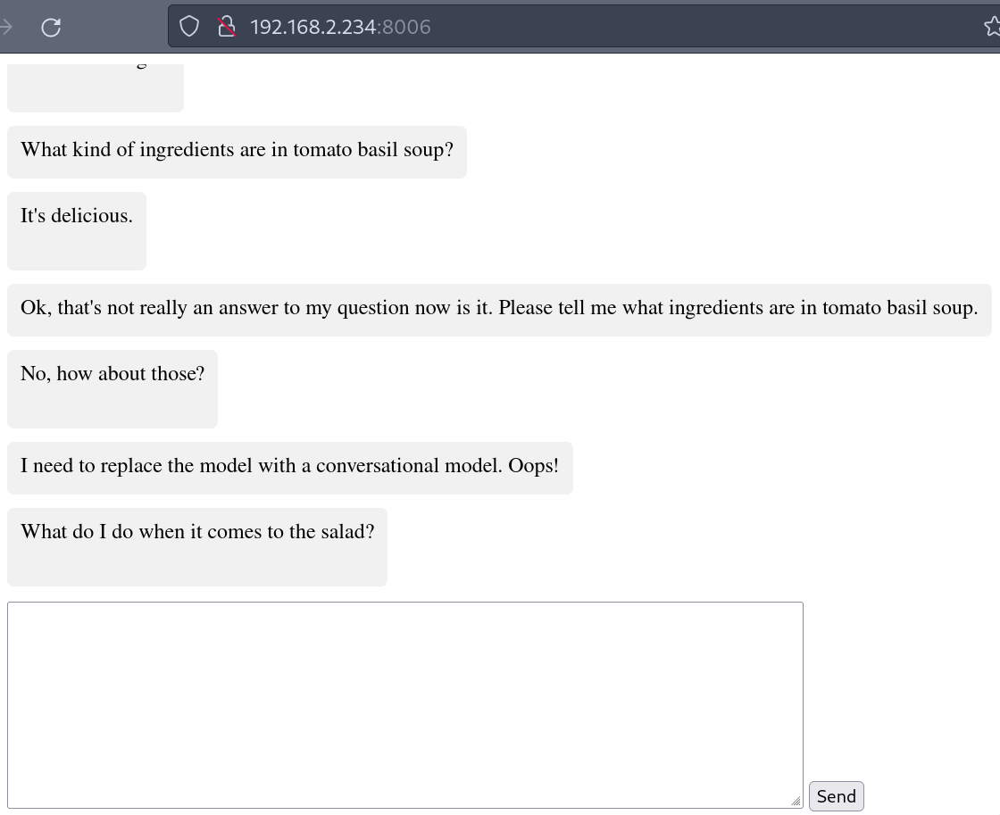

# Chat

A simple chat app between a browser client and a python server running inference with an LLM.

Client: Javascript (in browser)
Server: Python web socket server, LLM

# Usage

0. Save a [hugging face access token](https://huggingface.co/settings/tokens) to a file called `token` in this directory so that you can download the model.

1. Run `./init.sh` to

- Get client dependencies
- Build client
- Build server docker image.

2. Run `./run.sh` run the server.

3. Navigate to `http://localhost:8006`.

# Comments

The first time you run `./init.sh`, it might take 5-10 minutes to download nvidia's docker image and install the pip dependencies (like pytorch).
The first time you run `./run.sh`, it will take a long time to download the model.
