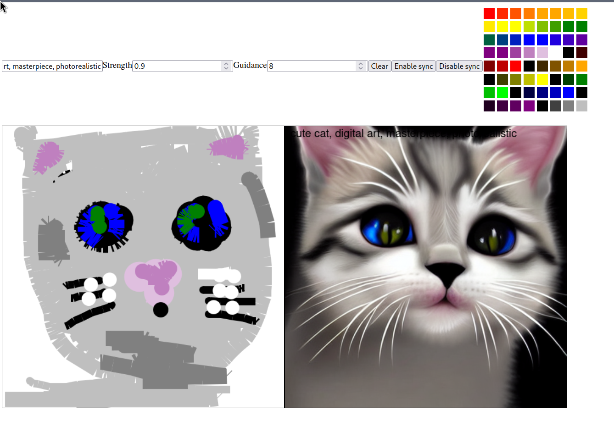

# Doodle

A simple doodling app running stable diffusion inference.

Video demos:

- https://www.youtube.com/watch?v=3y3eY9DFZMQ
- https://www.youtube.com/watch?v=QH9Zqv0iC6I

## Setup

0. Save a [hugging face access token](https://huggingface.co/settings/tokens) to a file called `token` in this directory so that you can download the model.
1. Run `./init.sh` to build the docker image.
1. Run `./run.sh` to run the docker image.
1. Open `http://localhost:8001` in your browser.

The first time you run the app, the server will download the model.
The `./run.sh` command will mount `client/` and `server/` directories, so you can easily edit the code to play around with while the container keeps running.

## Client

Browser. Javascript. HTML.

A text input where the user can write a prompt.
A canvas where the user can draw.
A canvas where the AI is generating images based on the two inputs.

## Server

Python. Flask. Diffusers.

A web server that accepts text and image, runs diffusion inference, and returns an image.
