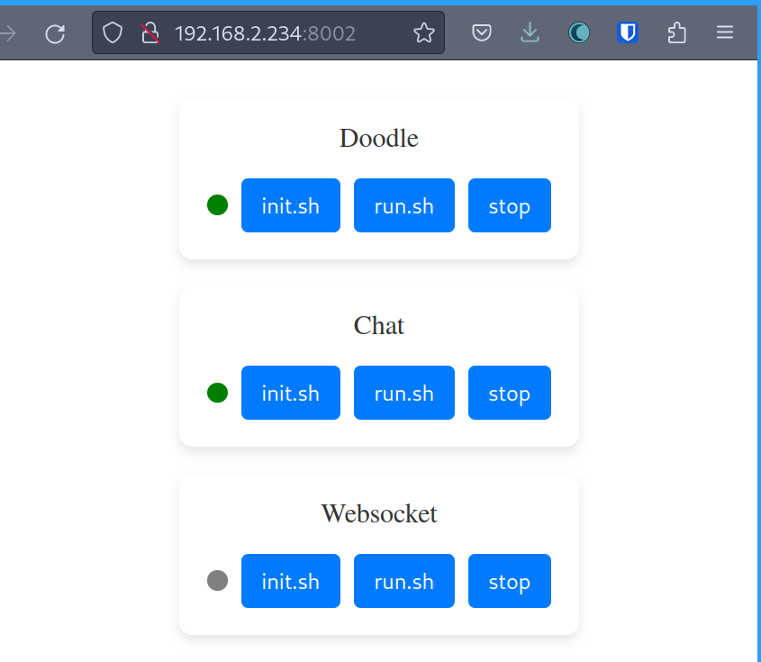

# Browserlab Launcher

An app that will launch the other browserlab apps.

Client: Javascript
Server: Python / Flask / Shell

# Usage

0. Save a [hugging face access token](https://huggingface.co/settings/tokens) to a file called `token` in this directory.
1. Run `./init.sh` to build the server.
2. Run `./run.sh` to run it.
