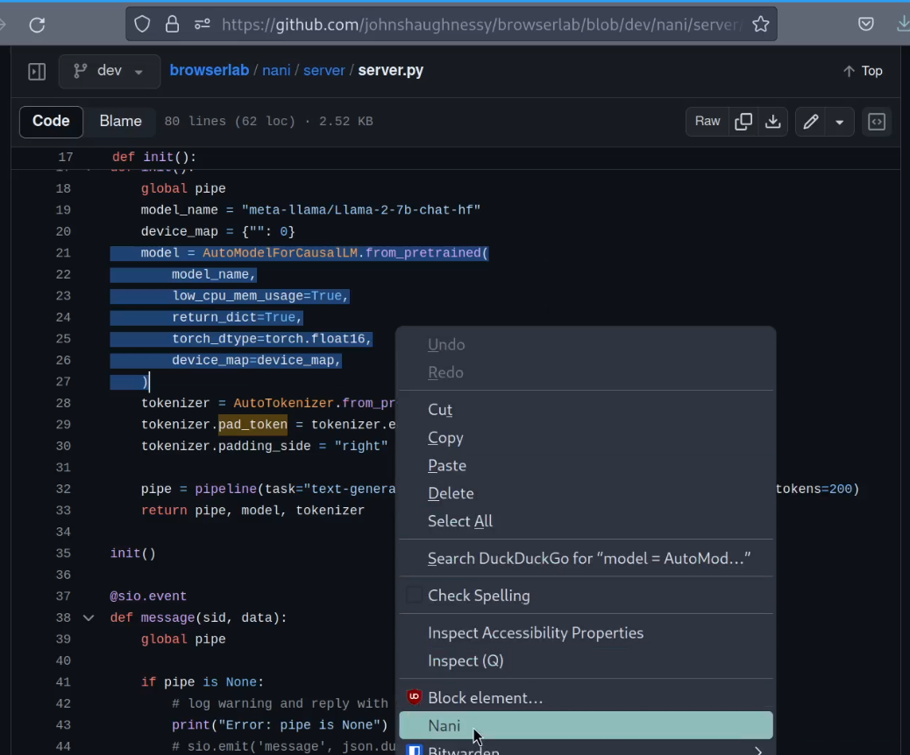
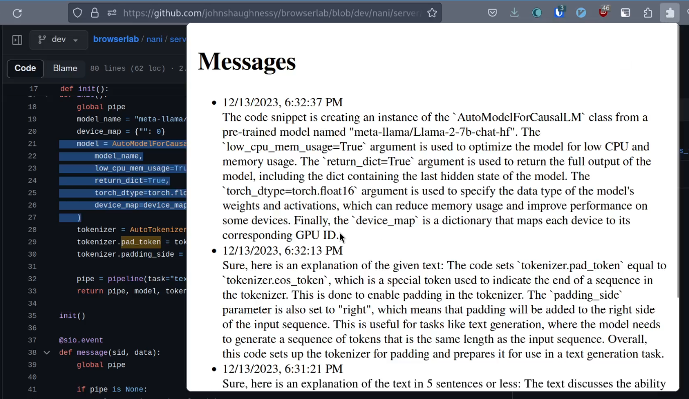

# Nani

Named for the Japanese 何 (なに), "Nani" is a browser extension that explains whatever text you ask it about, in the context of the page you found it on.

# Usage

- Run `init.sh` in the client subdirectory.
- Load `manifest.json` file as a firefox extension (from `about:debugging`).

- Run `init.sh` in the server subdirectory.
- Run `run.sh` in the server subdirectory.

You will need to modify the script slightly to make sure the client is connecting to the correct server address. This has not been exposed as a user-configurable setting.
