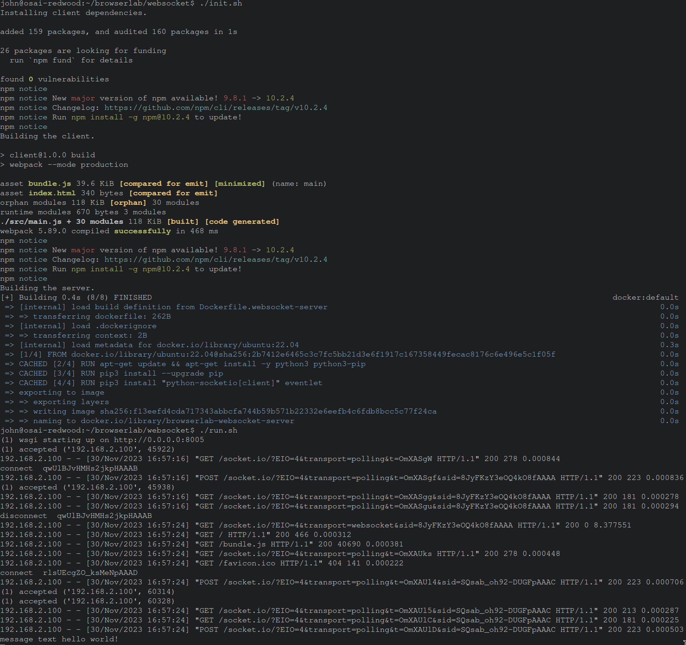
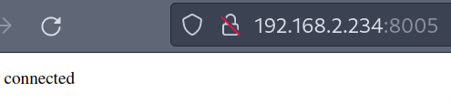
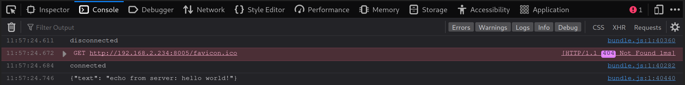

# Websocket Demo

The purpose of this demo is to get simple http and websocket connections working between a browser client and a python server.

This setup is a useful start point.

Client: Javascript (in browser)
Server: Python web socket server

# Usage

1. Run `./init.sh` to

- Get client dependencies
- Build client
- Build server docker image

2. Run `./run.sh` run the server.

3. Navigate to `http://localhost:8005`.

# Screenshots

The server will log the messages it receives from the client.

The client will report when it is connected to the server.

The client console will log the messages it receives from the server.

